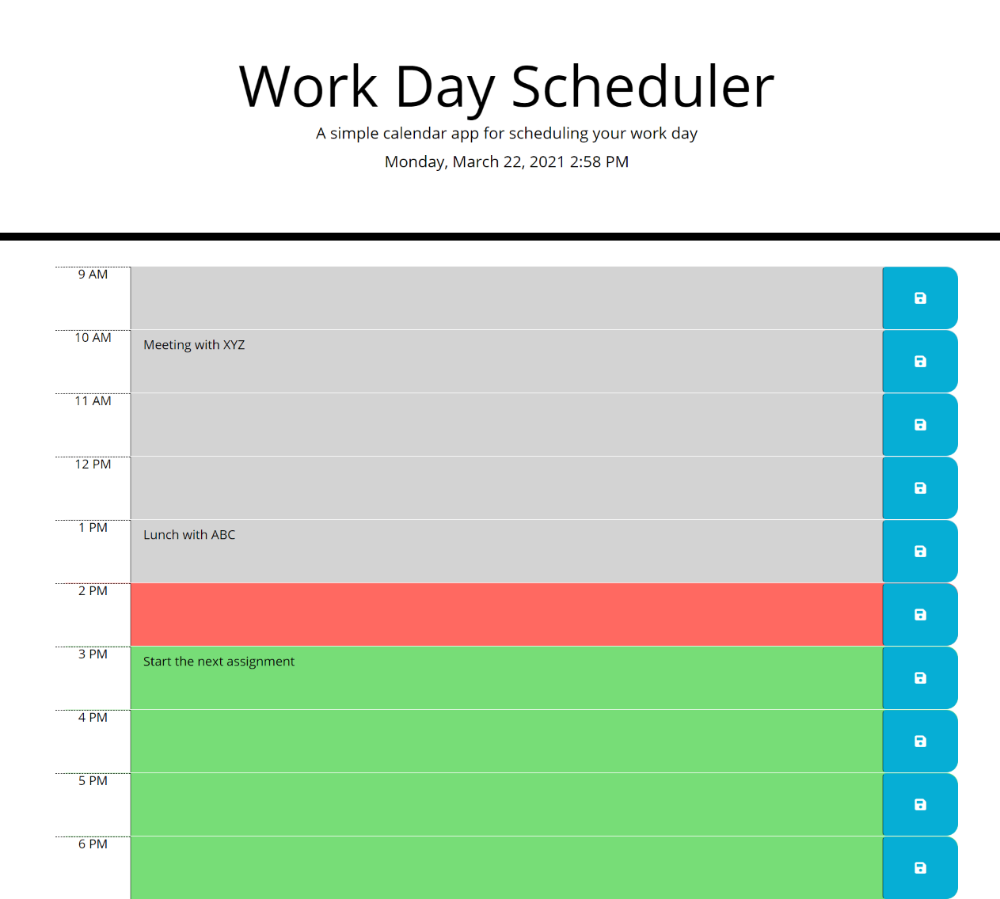

# Workday_Planner-DR

## Table of Contents
* [Introduction](#introduction)
* [Screenshot of the Application](#webpage)
* [Working of the Application](#web)
* [Installations](#installations)
* [Libraries taken](#details)
* [Credits](#credits)

 ## Introduction 
It is a  calendar application that allows a user to save events for each hour of the day by modifying starter code.My aim was to create a work day planner for each hour of a day from 9am to 6 pm. ican storemy schedule using local storage and it is built using **Javascript** programming language along with the help of certain libraries like ***Bootstrap,moment.js and jQuery*** to name a few.
 
 
 ## Screenshot of the Application
 The screenshot of the application looks almost similar to the one as shown here.

 
 
 
 ## Working of the Application
   A schedule between the time from __9 am to 6 pm__ has been created and the current day day and time are displayed on the top of the page.
   The planner is created for __an hour__ each.
   The user is required to choose a time slot to __enter a task__ which are then __stored__ in the __local storage__.
   Even on __refreshing__ the page, the task is __still accessible__ to the user.
   The workday id divided into three classes, namely, past, present and future.
   The __three colors__, which are grey,red and green have been __related__ with the respective classes.
    The Planner gets __updated__ to a __new day and a new time__ if you click on in on any __other__ day.
   

 
 
 ## Installations
   * [The URL of the Github repo](https://github.com/Dipti2021/Workday_Planner-DR)
   * [The URL of the deployed application](https://dipti2021.github.io/Workday_Planner-DR)
 

  *Keeping all these conditions in mind, I have created the Javascript code using the if, else if else conditions along with the code snippets taken from various libraries*
  
 ## Libraries taken
   * [Bootstrap](https://getbootstrap.com/).
   * [jQuery](https://jquery.com/).
   * [moment.js](https://momentjs.com/).

 ## Credits
    The homework has been assigned to me by the Carleton University Coding Bootcamp, our instructor and the TA's
   
     
